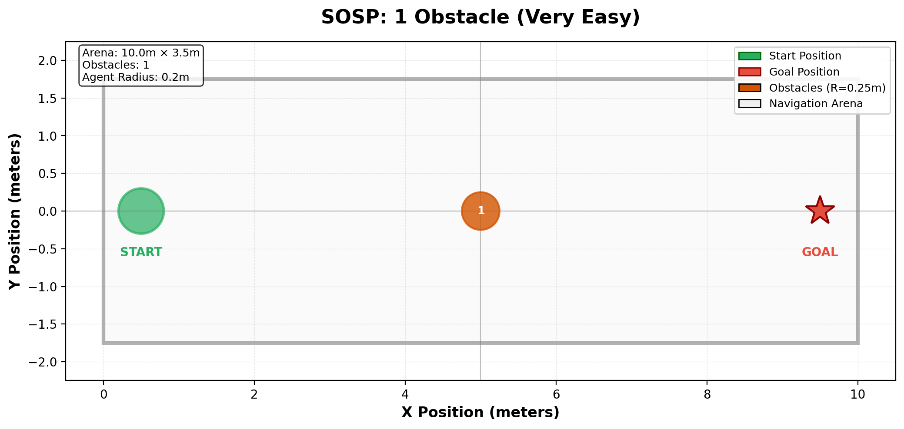
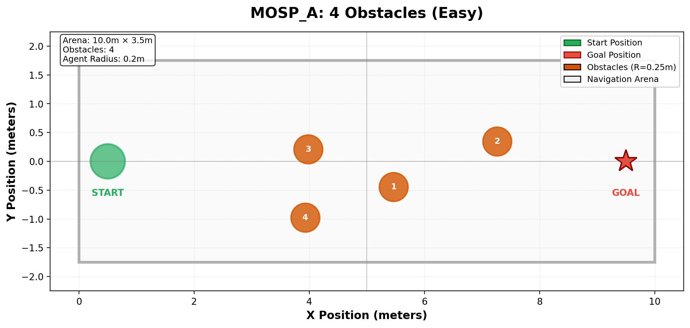
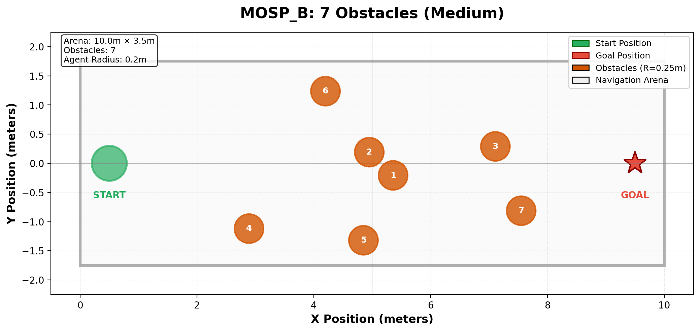
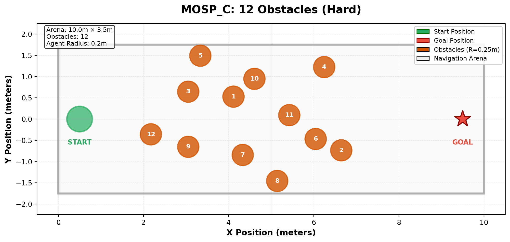
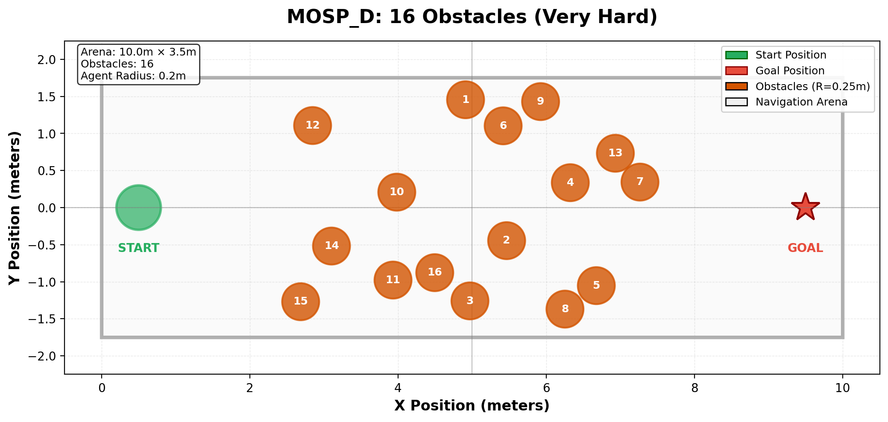
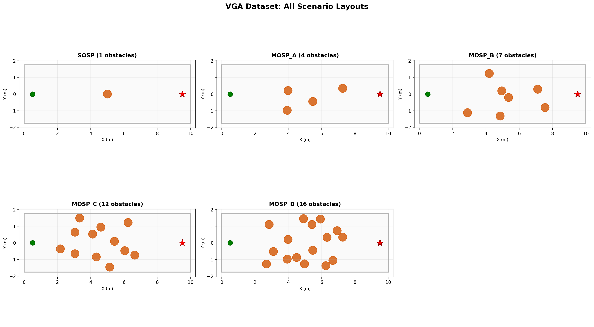

# VGA-Experimental-Data: Dataset Documentation

## Overview

This dataset contains **941 experimental trials** from real-world pedestrian navigation experiments conducted with the Velocity Grid Algorithm (VGA). The data represents human navigation trajectories in different obstacle configurations, used for evaluating and comparing navigation algorithms.

---

## Dataset Structure

### Scenarios

| Scenario         | Obstacles | Trials        | Difficulty | Max Time | Description                                   |
| ---------------- | --------- | ------------- | ---------- | -------- | --------------------------------------------- |
| **SOSP**   | 1         | 54            | Very Easy  | 6.833s   | Single Obstacle Static Pedestrian             |
| **MOSP-A** | 4         | 239           | Easy       | 10.866s  | Multiple Obstacles Static Pedestrian (Case A) |
| **MOSP-B** | 7         | 188           | Medium     | 11.266s  | Multiple Obstacles Static Pedestrian (Case B) |
| **MOSP-C** | 12        | 184           | Hard       | 11.466s  | Multiple Obstacles Static Pedestrian (Case C) |
| **MOSP-D** | 16        | 276           | Very Hard  | 12.833s  | Multiple Obstacles Static Pedestrian (Case D) |
| **Total**  | -         | **941** | -          | -        | -                                             |

---

## Scenario Visualizations

### SOSP: Single Obstacle (1 obstacle, 54 trials)



**Characteristics:**

- Simplest navigation scenario
- Single static obstacle at center of arena
- Tests basic obstacle avoidance capability
- Short trial duration (~6.8s average)

---

### MOSP-A: Easy Configuration (4 obstacles, 239 trials)



**Characteristics:**

- Four strategically placed obstacles
- Multiple navigation paths available
- Tests path selection and planning
- Moderate trial duration (~10.9s average)

---

### MOSP-B: Medium Configuration (7 obstacles, 188 trials)



**Characteristics:**

- Seven obstacles creating narrow passages
- Requires careful maneuvering
- Tests dynamic replanning capabilities
- Increased navigation complexity

---

### MOSP-C: Hard Configuration (12 obstacles, 184 trials)



**Characteristics:**

- Dense obstacle field (12 obstacles)
- Very narrow navigation corridors
- High risk of collision or getting trapped
- Tests advanced planning and local control

---

### MOSP-D: Very Hard Configuration (16 obstacles, 276 trials)



**Characteristics:**

- Most challenging scenario with 16 obstacles
- Highest trial count (276 trials)
- Extremely constrained environment
- Tests robustness under high obstacle density

---

## Data Format

### 1. Initial/Final Position Files

**Format:** `{Scenario}_initialFinalPos_feed.txt`

#### SOSP (6 columns):

```
pedInitialPos_x, pedInitialPos_y, pedFinalPos_x, pedFinalPos_y, pedDesiredSpeed, ExpNo.
```

#### MOSP Cases (7 columns):

```
pedInitialPos_x, pedInitialPos_y, pedFinalPos_x, pedFinalPos_y, pedDesiredSpeed, ExpNo., idxNo.
```

**Example (SOSP):**

```csv
9.635, -0.178, 0.000, -0.132, 1.311, 1
9.971, -0.130, 0.025, -0.093, 1.376, 2
```

**Example (MOSP-A):**

```csv
0.035, -0.325, 9.990, -0.286, 1.498, 1, 5
0.029, 1.498, 9.986, 1.168, 1.804, 2, 1
```

---

### 2. Obstacle Position Files

**Format:** `{Scenario}_obstPos_feed.txt`

#### Structure (3 columns):

```
obstPos_x, obstPos_y, obstNo.
```

**Note:** Obstacle positions are **fixed** for each scenario (obstacles do not move between trials).

**Obstacle Radius:** 0.25 meters (fixed for all obstacles)

---

## Trial Variations

### What Changes Between Trials?

Each trial in a scenario has:

- **Different start positions** (random within start zone)
- **Different goal positions** (random within goal zone)
- **Different desired speeds** (varies by participant/trial)
- **Same obstacle configuration** (fixed layout per scenario)

### Why Multiple Trials?

- **Capture human variability:** Different humans navigate differently
- **Robustness testing:** Algorithms must handle diverse start/goal pairs
- **Statistical significance:** Large sample sizes for reliable evaluation
- **Edge cases:** Some trials have challenging start-goal configurations

---

## Arena Configuration

### Physical Dimensions

- **Length:** 10.0 meters (X-axis)
- **Width:** 3.5 meters (Y-axis: -1.75 to +1.75)
- **Agent radius:** 0.2 meters
- **Obstacle radius:** 0.25 meters

### Start/Goal Zones

- **Start region:** Near X = 0 (left side of arena)
- **Goal region:** Near X = 10 (right side of arena)
- **Y-coordinates:** Vary randomly within arena bounds

---

## Statistical Summary

### Trials Distribution

```
SOSP:    54 trials (5.7%)   ████░░░░░░░░░░░░░░░░
MOSP-A: 239 trials (25.4%)  ████████████████░░░░
MOSP-B: 188 trials (20.0%)  ████████████░░░░░░░░
MOSP-C: 184 trials (19.6%)  ████████████░░░░░░░░
MOSP-D: 276 trials (29.3%)  ██████████████████░░
```

### Difficulty Progression

```
Obstacles:  1  →  4  →  7  →  12  →  16
Duration:  6.8s → 10.9s → 11.3s → 11.5s → 12.8s
Trials:     54  → 239  → 188  → 184  → 276
```

---

## Usage in Research

### Training Navigation Algorithms

- **DRL Training:** Use diverse start/goal pairs to train robust policies
- **Planning Algorithms:** Test path planning under various obstacle densities
- **Imitation Learning:** Learn from human trajectories in different scenarios

### Evaluation Metrics

- **Success Rate:** Percentage of trials reaching goal without collision
- **Path Efficiency:** Actual path length vs. straight-line distance
- **Navigation Time:** Time taken to reach goal
- **Safety Margin:** Minimum distance to obstacles during navigation

### Benchmark Comparisons

- **VGA Baseline:** Original algorithm tested on this data
- **DRL (PPO):** Deep Reinforcement Learning comparison
- **Classical Planning:** RRT, A*, potential fields, etc.

---

## File Listing

```
VGA-Experimental-Data/
├── README.md                                   # Original dataset documentation
├── SOSP_initialFinalPos_feed.txt              # 54 trials
├── SOSP_obstPos_feed.txt                      # 1 obstacle
├── MOSP_CaseA_initialFinalPos_feed.txt        # 239 trials
├── MOSP_CaseA_obstPos_feed.txt                # 4 obstacles
├── MOSP_CaseB_initialFinalPos_feed.txt        # 188 trials
├── MOSP_CaseB_obstPos_feed.txt                # 7 obstacles
├── MOSP_CaseC_initialFinalPos_feed.txt        # 184 trials
├── MOSP_CaseC_obstPos_feed.txt                # 12 obstacles
├── MOSP_CaseD_initialFinalPos_feed.txt        # 276 trials
└── MOSP_CaseD_obstPos_feed.txt                # 16 obstacles
```

---

## Loading Data (Python Example)

```python
import numpy as np

# Load initial/final positions
def load_trial_data(scenario_name):
    """Load trial data for a given scenario."""
    file_path = f'VGA-Experimental-Data/{scenario_name}_initialFinalPos_feed.txt'
    data = np.loadtxt(file_path, delimiter=',')
  
    if scenario_name == 'SOSP':
        # 6 columns: start_x, start_y, goal_x, goal_y, speed, exp_no
        return {
            'start_positions': data[:, :2],
            'goal_positions': data[:, 2:4],
            'desired_speeds': data[:, 4],
            'trial_ids': data[:, 5]
        }
    else:
        # 7 columns: start_x, start_y, goal_x, goal_y, speed, exp_no, idx_no
        return {
            'start_positions': data[:, :2],
            'goal_positions': data[:, 2:4],
            'desired_speeds': data[:, 4],
            'trial_ids': data[:, 5],
            'idx_numbers': data[:, 6]
        }

# Load obstacle positions
def load_obstacles(scenario_name):
    """Load obstacle positions for a given scenario."""
    file_path = f'VGA-Experimental-Data/{scenario_name}_obstPos_feed.txt'
    data = np.loadtxt(file_path, delimiter=',')
    return {
        'positions': data[:, :2],  # x, y coordinates
        'obstacle_ids': data[:, 2]
    }

# Example usage
sosp_trials = load_trial_data('SOSP')
sosp_obstacles = load_obstacles('SOSP')

print(f"SOSP has {len(sosp_trials['start_positions'])} trials")
print(f"SOSP has {len(sosp_obstacles['positions'])} obstacles")
```

---

## All Scenarios Overview



---

## References

**Original Paper:** Velocity Grid Algorithm for pedestrian navigation
**Dataset Source:** Real-world human pedestrian experiments
**Application:** Benchmarking navigation algorithms (DRL, classical planning, etc.)

---

## Notes

- All distances in **meters**
- All times in **seconds**
- Coordinate system: (0, 0) at bottom-left, (10, 1.75) at top-right
- Obstacles are **circular** with radius 0.25m
- Agents are **circular** with radius 0.2m
